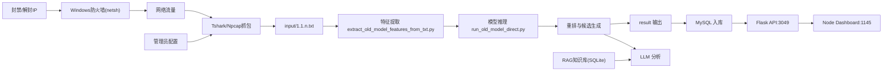

# AI攻击态势感知平台详细设计报告

版本：v1.0  
日期：2026-04-29

## 1. 项目目标与范围

本项目目标是构建一套在 Windows 环境可运行的本地化攻击态势感知系统，打通以下全流程：

1. 流量采集（端口监听/抓包）
2. 特征提取与模型识别
3. LLM/RAG 研判
4. 结果入库（MySQL）
5. API 服务（Flask）
6. 前端可视化大屏（Node）
7. 联动处置（IP 封禁/解封）

本报告聚焦“详细设计”，覆盖函数级、接口级、数据结构、时序和异常处理。

---

## 2. 总体架构设计

---

## 3. 代码模块与职责

### 3.1 编排入口（app.py）

文件：`app.py`

职责：
1. 解析参数与配置
2. 依赖检查与路径初始化
3. 管理员提权（Windows）
4. 启动/停止子进程（抓包、检测、LLM、入库、API、前端）
5. 运行时状态输出

核心函数：
1. `add_arguments(parser)`
2. `apply_db_config(args, parser, project_root)`
3. `parse_ports_text(text, fallback)`
4. `load_capture_runtime_config(args, fallback_ports, fallback_batch_size)`
5. `build_capture_cmd(...)`
6. `build_daemon_cmd(...)`
7. `build_llm_cmd(...)`
8. `build_db_cmd(...)`
9. `build_api_cmd(...)`
10. `build_dashboard_cmd(...)`
11. `terminate_process(proc, name, log_path)`
12. `main()`

---

### 3.2 抓包模块（capture_http_request_batches.py）

文件：`scripts/capture_http_request_batches.py`

职责：
1. 调用 tshark 抓 HTTP 流量
2. 请求/响应配对
3. 按批次写入 `input/1.1.n.txt`

核心函数：
1. `find_executable(name)`
2. `list_interfaces(tshark_exe, timeout)`
3. `choose_interface(interfaces, preferred_name)`
4. `detect_http_link_fields(tshark_exe)`
5. `build_request_from_fields(...)`
6. `build_response_from_fields(...)`
7. `write_canonical_batch(...)`
8. `main()`

稳定性设计（已实现）：
1. `--interface` 支持索引直连（例：`--interface 1`）
2. `--interface-list-timeout` 控制网卡枚举超时
3. 检查 Npcap `AdminOnly=1` + 非管理员场景，快速失败并提示

---

### 3.3 API 模块（dashboard_api_server.py）

文件：`scripts/dashboard_api_server.py`

职责：
1. JWT 认证与 RBAC 权限控制
2. 业务查询接口（大屏、详情、管理员）
3. 插件接口（钓鱼检测、IP 分析、本机状态）
4. RAG 文档管理接口
5. 防火墙联动（封禁/解封）

核心基础函数：
1. `create_app(...)`
2. `get_conn(mysql_conf, autocommit=False)`
3. `ensure_schema(conn)`
4. `log_action(conn, username, role, action, target, detail)`
5. `create_jwt_token(...)`
6. `decode_jwt_token(...)`
7. `require_roles(*roles)`
8. `set_auth_cookie(...) / clear_auth_cookie(...)`
9. `firewall_block_ip(ip_text)`
10. `firewall_unblock_ip(ip_text)`
11. `collect_event_block_ips(...)`
12. `resolve_region_for_event(...)`
13. `ensure_rag_schema(...)`
14. `rag_upsert_doc(...)`
15. `rag_list_docs(...)`
16. `rag_rebuild_from_seed(...)`

---

## 4. 函数级详细设计（关键函数）

### 4.1 `app.py::main()`

输入：
1. CLI 参数

处理：
1. 参数解析、模式判定（only-capture/only-detect）
2. 目录初始化（input/output/result/app_runtime）
3. 动态配置加载（端口、批大小）
4. 组装并启动子进程
5. 监控与退出回收

输出：
1. 各服务子进程持续运行
2. 运行状态文件与日志

异常处理：
1. 参数非法时 `parser.error`
2. 子脚本缺失时抛错退出
3. Windows 提权失败时明确提示

---

### 4.2 `capture_http_request_batches.py::main()`

输入：
1. 抓包参数（端口、网卡、批大小、输出目录）

处理：
1. 校验 Npcap 权限与 tshark 可用性
2. 枚举/选择网卡
3. 启动 tshark 流式输出
4. 解析字段并建立 request/response 映射
5. 达到批大小后写 `1.1.n.txt`

输出：
1. 标准批处理输入文件

异常处理：
1. 字段缺失时抛出明确错误
2. 无管理员权限且 AdminOnly 场景快速退出

---

### 4.3 `dashboard_api_server.py::create_app(...)`

输入：
1. MySQL 配置
2. RAG 路径与种子路径
3. JWT 密钥及过期策略

处理：
1. 初始化 Flask 配置
2. 建表 `ensure_schema`
3. 初始化管理员账号与演示数据
4. 初始化 RAG 库与种子
5. 注册全量 API 路由

输出：
1. Flask app 对象

异常处理：
1. DB 不可连通直接失败
2. JWT secret 缺失时生成临时 secret 并告警

---

### 4.4 `firewall_block_ip(ip_text)` / `firewall_unblock_ip(ip_text)`

输入：
1. `ip_text`（IPv4/IPv6）

处理：
1. 规范化 IP
2. 构造入站/出站规则名
3. 调用 `netsh advfirewall` 添加/删除规则

输出：
1. `(ok: bool, detail: str)`

异常处理：
1. 命令失败返回详细 stderr
2. 上层接口收到失败会返回 500，并提示管理员权限要求

---

## 5. 接口级详细设计

Base URL：`http://127.0.0.1:3049`

### 5.1 认证接口

1. `POST /api/v2/auth/register`
2. `POST /api/v2/auth/login`
3. `POST /api/v2/auth/logout`
4. `GET /api/v2/auth/profile`
5. `POST /api/v2/auth/change-password`

鉴权机制：
1. JWT（HS256）
2. Header Bearer + Cookie 双通道
3. Token 过期、撤销（revoked jti）校验

权限模型：
1. `normal`
2. `admin`

---

### 5.2 大屏接口（normal/admin）

1. `GET /api/v2/user/dashboard/kpis`
2. `GET /api/v2/user/dashboard/trend7d`
3. `GET /api/v2/user/dashboard/top-attack-types`
4. `GET /api/v2/user/dashboard/source-distribution`
5. `GET /api/v2/user/dashboard/heatmap`
6. `GET /api/v2/user/dashboard/method-share`

---

### 5.3 详情与处置接口（normal/admin）

1. `GET /api/v2/pro/events`
2. `GET /api/v2/pro/events/{event_id}`
3. `POST /api/v2/pro/events/{event_id}/block-ip`
4. `POST /api/v2/pro/events/{event_id}/unblock-ip`
5. `GET /api/v2/pro/blocked-ips`
6. `POST /api/v2/pro/blocked-ips/unblock`

关键设计：
1. 封禁必须调用系统防火墙，不是仅改数据库状态
2. 失败回滚：部分封禁成功后若后续失败，执行回滚解封

---

### 5.4 管理员接口（admin）

1. `GET /api/v2/admin/summary`
2. `GET /api/v2/admin/machines`
3. `GET /api/v2/admin/user-op-logs`
4. `GET /api/v2/admin/config`
5. `PUT /api/v2/admin/config`
6. `GET /api/v2/admin/users`
7. `PUT /api/v2/admin/users/{username}/password`
8. `GET /api/v2/admin/reports/export`

`PUT /api/v2/admin/config` 校验规则：
1. `capture_batch_size`：1~128
2. `monitor_ports`：1~65535，逗号分隔
3. `auto_refresh_seconds`：1~3600
4. `alert_threshold_high`：1~100000
5. `sound_alert_enabled`：0/1

---

### 5.5 插件接口

1. `POST /api/v2/plugins/phishing/check`
2. `POST /api/v2/plugins/ip-analyze`
3. `GET /api/v2/plugins/local-status`

钓鱼检测接口逻辑：
1. 校验 url/token
2. 转发至 `ctf.ski:9898`
3. 透传并规范化 `action/verdict/confidence/reason/evidence`

---

### 5.6 RAG 接口（admin）

1. `GET /api/v2/rag/docs`
2. `POST /api/v2/rag/docs`
3. `POST /api/v2/rag/docs/{doc_id}/delete`
4. `POST /api/v2/rag/rebuild`

---

## 6. 数据库详细设计

### 6.1 MySQL 表（核心）

1. `demo_users`
2. `demo_attack_events`
3. `demo_blocked_ips`
4. `demo_user_action_logs`
5. `demo_system_config`
6. `demo_machines`
7. `demo_model_metrics`
8. `ip_geo_cache`

### 6.2 关键表字段说明

`demo_attack_events`（事件主表）关键字段：
1. `event_id`：事件唯一标识
2. `occurred_at`：毫秒级时间
3. `risk_level`：高/中/低
4. `attack_type`：攻击类型
5. `source_ip`：攻击来源 IP
6. `source_region`：来源地区
7. `target_interface`：被攻击接口
8. `attack_result`：blocked/success
9. `process_status`：处理状态
10. `attack_payload`：攻击载荷
11. `request_log`：请求日志
12. `handling_suggestion`：处置建议

索引：
1. `idx_event_time`
2. `idx_event_risk`
3. `idx_event_type`
4. `idx_event_node`

---

## 7. 关键业务时序

### 7.1 登录时序
1. 前端提交用户名密码
2. 后端校验账户
3. 生成 JWT + 写 Cookie
4. 返回 profile 信息

### 7.2 检测时序
1. 抓包写入 `input/1.1.n.txt`
2. 守护进程发现新文件并触发检测
3. 模型输出分数与标签
4. 结果写入 result
5. 入库守护进程写入 MySQL
6. 前端刷新读取 API 数据

### 7.3 封禁时序
1. 用户点击封禁
2. 后端提取封禁 IP 列表
3. 调用防火墙添加规则
4. 写 `demo_blocked_ips`
5. 写操作日志
6. 返回封禁结果

---

## 8. 异常处理设计

统一错误策略：
1. 参数错误：400
2. 未认证：401
3. 无权限：403
4. 资源不存在：404
5. 上游故障：502
6. 内部执行失败：500

典型错误场景：
1. 抓包权限不足（Npcap AdminOnly + 非管理员）
2. 防火墙执行失败（无管理员权限）
3. 插件上游不可达
4. JWT 无效或过期

---

## 9. 安全设计

1. JWT 鉴权 + 角色授权双重控制
2. 管理员高危操作全量审计
3. 注册接口禁止创建管理员
4. 配置接口严格白名单校验
5. IP 封禁为真实系统规则，不允许“假封禁”

---

## 10. 部署与运行设计

### 10.1 运行端口
1. API：`3049`
2. Dashboard：`1145`
3. 靶场/测试端口：`3000`（按需）

### 10.2 启动方式（主入口）
1. `python app.py ...` 启动全流程
2. 支持 `--only-detect`、`--no-llm` 等组合模式

### 10.3 关键前置依赖
1. Python 3.10+
2. MySQL
3. Wireshark/Tshark + Npcap
4. Node.js
5. Ollama（LLM场景）

---

## 11. 测试设计

1. 单元测试：参数解析、JWT、IP规范化、配置校验
2. 接口测试：认证、查询、封禁解封、RAG、插件
3. 联调测试：抓包→检测→结果→入库→大屏刷新
4. 权限测试：normal/admin 越权校验
5. 运维测试：重启恢复、异常兜底、日志可追溯

---

## 12. 附录

### 12.1 主要代码文件
1. `app.py`
2. `scripts/capture_http_request_batches.py`
3. `scripts/dashboard_api_server.py`
4. `scripts/run_demo_daemon.py`
5. `docs/API_DECLARATION.md`

### 12.2 报告使用说明
本文件可直接作为“详细设计章节”提交。若需学校/单位模板，可在此基础上补充：
1. 章节编号格式
2. 项目组织封面信息
3. 引用与参考文献

